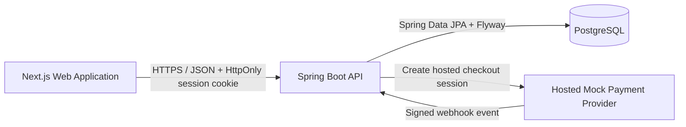

# TicketPass

> A production-minded full-stack ticket resale marketplace built to demonstrate secure system design, transactional workflows, and concurrency-safe marketplace operations.


## About

TicketPass is a portfolio-grade monorepo for a two-sided ticket marketplace where sellers list transferable tickets and buyers browse, reserve, and complete checkout through a hosted mock-payment flow.

The project is intentionally designed beyond a basic CRUD application. It addresses marketplace problems such as competing reservations, expired inventory holds, duplicate requests, delayed payment events, webhook retries, stale browser state, authorization boundaries, and auditability.

Built and maintained by [VietCT04](https://github.com/VietCT04), this repository demonstrates my approach to:

- full-stack product development across Next.js and Spring Boot;
- domain modelling for listings, reservations, orders, payments, and audit events;
- transactional consistency and pessimistic locking for contested inventory;
- idempotent APIs, webhook deduplication, and recoverable reconciliation;
- secure cookie-based authentication and server-authoritative ownership;
- database migrations, explicit API contracts, and structured engineering documentation.

## What Is Implemented

### Identity and application security

- Email/password signup and login.
- Server-side opaque sessions stored as hashes.
- `HttpOnly` cookie authentication with revocation-based logout.
- Protected frontend routes backed by `GET /api/me`.
- Server-derived seller and buyer ownership instead of client-supplied user IDs.
- Trusted-origin protection for unsafe cookie-authenticated requests.
- `Cache-Control: no-store` on private account and marketplace responses.
- Explicit safe response DTOs that exclude session secrets and sensitive ticket payloads.

### Seller marketplace workflow

- Authenticated event autocomplete.
- Seller listing creation linked to an approved future event.
- Strict validation for price, ticket metadata, transfer method, and transferability confirmation.
- Immutable `LISTING_CREATED` audit records written in the same transaction as the listing.
- Missing-event request workflow with normalized metadata and duplicate protection.
- Protected seller listing history with exact status filtering and database-side pagination.

### Buyer reservation and checkout workflow

- Public event browsing and event-detail inventory views.
- Buyer-owned ticket reservations with a server-authoritative expiry time.
- Listing-first pessimistic locking to prevent competing buyers from reserving the same listing.
- Idempotent reservation creation and safe expiry reconciliation.
- One order per reservation with persisted amount, currency, status, and expiry.
- Hosted mock-payment sessions with signed webhook delivery.
- Atomic webhook receipt deduplication and payment-state transitions.
- Controlled handling for payment success, failure, cancellation, expiry, and late inconsistent events.
- Protected buyer order reads for recovering server-authoritative checkout state.

## Architecture



The frontend is a usability layer; the backend remains authoritative for authentication, ownership, validation, inventory visibility, pricing, pagination, and lifecycle transitions.

## Engineering Highlights

### Concurrency-safe inventory

Reservation and checkout transitions use explicit lock ordering and state revalidation. A listing is locked before its reservation or order so concurrent requests cannot oversell inventory or reactivate a listing after a later terminal transition.

### Idempotent payment processing

Payment delivery is treated as an unreliable distributed-system boundary. Provider events are signed, recorded in a receipt ledger, deduplicated, and reconciled against the latest order, reservation, and listing state before any sale transition is committed.

### Transactional auditability

Sensitive marketplace changes write minimal audit records in the same database transaction as the business operation. Audit rows contain actor, action, entity, and server timestamp—not raw ticket files, QR codes, credentials, request bodies, or private transfer data.

### Security by server authority

The application does not trust browser-held ownership or workflow state. User identity comes from the authenticated principal, private responses are non-cacheable, unsafe requests are origin-checked, and user-entered text is rendered without raw HTML or automatic linkification.

### Product and architecture discipline

Work is decomposed from user stories into focused contract, persistence, backend, frontend, security, and operational issues. Important decisions are documented before implementation so API, database, concurrency, and privacy rules remain consistent across features.

## Technology Stack

| Layer | Technology |
|---|---|
| Frontend | Next.js 16, React, TypeScript, Tailwind CSS |
| Backend | Java 21, Spring Boot, Spring Security, Spring Data JPA |
| Database | PostgreSQL, Flyway migrations |
| Authentication | Opaque server-side sessions, BCrypt, secure cookies |
| Payments | Provider-neutral order model and hosted mock-payment adapter |
| Infrastructure | Docker Compose for local PostgreSQL and container-workflow planning |
| Build tooling | npm workspaces and Maven |

## Repository Structure

```text
apps/web              Next.js frontend
apps/api              Spring Boot backend
packages/shared       Shared package space
docs/API.md           API contracts
docs/DATABASE.md      Persistence model and migrations
docs/SECURITY.md      Authentication, authorization, and data boundaries
docs/flows            End-to-end marketplace flows
docs/user-stories     Product stories and delivery decomposition
docs/CONTINUITY.md    Current implementation state and handoff history
docker-compose.yml    Local service dependencies
```

## Review the Engineering Depth

The fastest files for a technical or hiring review are:

- [`docs/SECURITY.md`](docs/SECURITY.md) — authentication, authorization, CSRF, privacy, and logging boundaries;
- [`docs/DATABASE.md`](docs/DATABASE.md) — relational model, constraints, indexes, and migration history;
- [`docs/API.md`](docs/API.md) — request, response, validation, and lifecycle contracts;
- [`docs/flows`](docs/flows) — seller, buyer, reservation, checkout, and transfer flows;
- [`docs/CONTINUITY.md`](docs/CONTINUITY.md) — completed work and current project state.

## Run Locally

### Prerequisites

- Node.js 20.19+ or 22.13+
- Java 21
- Maven 3.9+
- Docker

### 1. Start PostgreSQL

```bash
docker compose up -d postgres
```

Local database defaults:

```text
Host: localhost:5432
Database: ticketpass
User: ticketpass
Password: ticketpass
```

=======
## Container Stack Contract

The current Compose setup starts PostgreSQL only. The approved future full-stack container contract is documented in [docs/DEPLOYMENT.md](docs/DEPLOYMENT.md); Docker images and API/web Compose wiring are separate follow-up issues and are not implemented yet.

=======
### 2. Start the API

## Run Backend

```bash
cd apps/api
mvn spring-boot:run
```

The API runs at `http://localhost:8080`.

```bash
curl http://localhost:8080/api/health
```

Expected response:

```json
{"status":"ok"}
```

### 3. Start the web application

```bash
npm install
npm run dev:web
```

The frontend runs at `http://localhost:3000` and reads its API base URL from `apps/web/.env.local`.

## Current Scope

TicketPass is an actively developed portfolio project, not a production ticket exchange. The current payment provider is intentionally a local mock, and open user stories document future marketplace capabilities separately from implemented functionality.

The repository prioritizes clear invariants, safe failure handling, and honest system boundaries over presenting unfinished roadmap items as complete.
