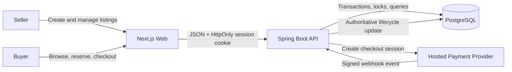

# TicketPass

> A full-stack ticket resale marketplace designed around secure ownership, concurrency-safe inventory, recoverable payments, and auditable marketplace operations.


## About

TicketPass is an actively developed two-sided marketplace where sellers list transferable event tickets and buyers discover events, reserve inventory, and complete checkout through a hosted payment flow.

The system is built around the failure modes that matter in a real marketplace:

- multiple buyers competing for the same listing;
- inventory holds expiring while checkout is in progress;
- duplicate client requests and webhook retries;
- delayed, missing, or inconsistent provider events;
- stale browser state after navigation or refresh;
- seller and buyer ownership boundaries;
- private account data and sensitive ticket-payload handling;
- immutable audit history for sensitive marketplace actions.

The backend remains authoritative for identity, ownership, prices, inventory visibility, pagination, deadlines, lifecycle transitions, and financial state. The frontend presents and submits user intent, but it does not decide marketplace truth.

## Implemented Product Capabilities

### Identity and session security

- Email/password signup and login.
- BCrypt password hashing.
- Random opaque session credentials with only token hashes persisted.
- `HttpOnly` cookie authentication.
- Revocation-based logout without deleting historical session records.
- Authenticated `GET /api/me` as the source of truth for current-user state.
- Protected frontend routes that verify the server session before rendering private workflows.
- Server-derived user ownership instead of accepting seller or buyer IDs from clients.
- Trusted-origin enforcement for unsafe cookie-authenticated requests.
- `Cache-Control: no-store` on private account and marketplace responses.
- Controlled authentication and authorization errors without exposing internal state.

### Public event discovery

- Public upcoming-event browsing.
- Public event-detail views with safe marketplace availability.
- Database-backed listing aggregates for visible events.
- Deterministic upcoming-event ordering and pagination.
- Authenticated event autocomplete for seller listing creation.
- Safe event metadata only; no seller identity, ticket payload, payment, or reservation-owner data is exposed.

### Seller listing workflow

- Authenticated listing creation linked to an existing future event.
- Validation for ticket type, seat information, event platform, transfer method, quantity, price, currency, public notes, and transferability confirmation.
- Seller ownership derived from the authenticated principal.
- Immutable `LISTING_CREATED` audit records written in the same database transaction as the listing.
- Audit records intentionally exclude prices, notes, ticket files, QR codes, barcodes, private links, credentials, and request bodies.
- Protected `/my-listings` account page.
- Server-authoritative exact status filtering and database-side pagination.
- Clear handling of `DRAFT`, `ACTIVE`, `RESERVED`, `SOLD`, `CANCELLED`, and `EXPIRED` listing states.
- Safe rendering of seller-entered metadata without raw HTML or automatic linkification.

### Missing-event request workflow

- Seller fallback when an event cannot be found through autocomplete.
- Authenticated durable event-request creation.
- Unicode-aware text normalization.
- Explicit-offset future event-time validation.
- HTTPS-only source URL validation where supplied.
- Requester-scoped pending duplicate recovery.
- Strict separation between a pending request and an approved catalogue event.
- Listing submission remains disabled until a real catalogue event is selected.

### Buyer reservation workflow

- Buyer-owned reservation creation for an available listing.
- Server-controlled reservation expiry.
- Listing-first pessimistic locking to prevent two buyers from reserving the same inventory.
- Revalidation of listing, event, reservation, and ownership state inside the transaction.
- Idempotent recovery of an existing compatible reservation.
- Expiry reconciliation that does not reactivate inventory after a later terminal state.
- Private reservation and checkout data excluded from public APIs.

### Checkout and order creation

- One order per reservation.
- Persisted order amount and currency derived from server-side listing state.
- Server-authoritative order and checkout expiry.
- Protected checkout recovery after refresh or navigation.
- Safe buyer order reads without exposing provider credentials or internal payment metadata.
- Controlled cancellation and expiry reconciliation for incomplete checkout attempts.

### Hosted payment lifecycle

- Provider-neutral payment boundary with a local hosted mock-payment adapter.
- Persisted payment-session state.
- Signed webhook delivery.
- Atomic webhook receipt ledger for deduplication.
- Idempotent processing of repeated provider events.
- Revalidation of order, reservation, listing, and expiry state before committing a sale.
- Controlled handling of payment success, failure, cancellation, expiry, malformed delivery, and late inconsistent events.
- Fail-closed routing and startup validation for mock-provider configuration.
- External provider work separated from marketplace database locks where required.

### Auditability and data protection

- Flyway-managed relational schema evolution.
- Explicit database constraints and indexed ownership/lifecycle queries.
- Minimal immutable audit events for sensitive actions.
- Explicit DTO projections instead of serializing persistence entities directly.
- Private responses exclude session credentials, password hashes, provider secrets, raw ticket files, QR codes, barcodes, and private transfer links.
- Logging and error responses are bounded to avoid leaking request bodies, SQL details, credentials, or private marketplace state.

## End-to-End Marketplace Flow



Typical lifecycle:

```text
Event
  -> Active seller listing
  -> Buyer reservation with expiry
  -> Order created from reservation
  -> Hosted checkout session
  -> Signed provider webhook
  -> Atomic payment and inventory reconciliation
  -> Sold listing and buyer-visible order state
```

## Core Engineering Design

### Concurrency-safe inventory

Ticket inventory is contested state. Reservation and checkout workflows use explicit lock ordering and transactional revalidation rather than relying on frontend state or optimistic assumptions.

The listing is locked before dependent reservation or order state. This prevents overselling, conflicting checkout creation, and accidental inventory reactivation after a newer terminal transition.

### Idempotent distributed workflows

Client retries and provider retries are expected behavior. TicketPass designs mutations around stable ownership and lifecycle checks so repeated compatible requests recover the existing result instead of creating duplicate reservations, orders, payment sessions, webhook transitions, or audit events.

### Recoverable payment processing

Payment delivery is treated as an unreliable distributed-system boundary. Provider events are authenticated, recorded, deduplicated, and reconciled against current marketplace state. A provider success event alone is not sufficient to sell inventory if the reservation, order, event, or expiry state is no longer compatible.

### Server-authoritative time and state

Deadlines and current state are generated and evaluated on the server. Browser countdowns are presentation only. Every action revalidates the authoritative database state so stale pages cannot extend reservations, complete invalid checkout, or override newer transitions.

### Transactional auditability

Business state and its audit event are committed together where audit coverage is required. Audit records contain identifiers, action, actor, entity type, entity ID, and server time rather than copying sensitive marketplace payloads.

### Security by boundary design

- Authentication comes from opaque server-side sessions.
- Authorization uses the authenticated principal and database ownership.
- The browser cannot submit authoritative seller IDs, buyer IDs, prices, statuses, or financial outcomes.
- Private data is non-cacheable.
- Unsafe cookie-authenticated requests are origin checked.
- User-entered text is rendered as escaped content.
- Public endpoints expose only intentionally approved projections.

## Architecture

| Layer | Responsibility | Technology |
|---|---|---|
| Web application | Public discovery, authentication, seller and buyer workflows | Next.js 16, React, TypeScript, Tailwind CSS |
| API | Authentication, authorization, validation, transactions, lifecycle orchestration | Java 21, Spring Boot, Spring Security, Spring Data JPA |
| Database | Marketplace authority, constraints, locks, history, idempotency records | PostgreSQL 16, Flyway |
| Payment boundary | Hosted checkout and webhook lifecycle | Provider-neutral interface with local mock adapter |
| Local infrastructure | Development service orchestration | Docker Compose |

## Repository Structure

```text
apps/web              Next.js web application
apps/api              Spring Boot API
packages/shared       Shared package space
docs/API.md           API contracts and lifecycle responses
docs/DATABASE.md      Data model, constraints, indexes, and migrations
docs/SECURITY.md      Authentication, authorization, privacy, and logging rules
docs/flows            End-to-end seller, buyer, reservation, checkout, and transfer flows
docs/user-stories     Product stories and delivery decomposition
docs/CONCERNS.md      Known risks and unresolved production concerns
docs/CONTINUITY.md    Current implementation state and delivery history
docker-compose.yml    Local service dependencies
```

## System Documentation

- [`docs/API.md`](docs/API.md) defines endpoint contracts, validation, response shapes, and lifecycle behavior.
- [`docs/DATABASE.md`](docs/DATABASE.md) defines relational ownership, constraints, indexes, migrations, and state persistence.
- [`docs/SECURITY.md`](docs/SECURITY.md) defines authentication, authorization, trusted-origin, privacy, logging, and sensitive-data boundaries.
- [`docs/flows`](docs/flows) documents marketplace workflows across sellers, buyers, reservations, checkout, and payment handling.
- [`docs/user-stories`](docs/user-stories) records product intent, scope boundaries, dependencies, acceptance criteria, and delivery order.
- [`docs/CONCERNS.md`](docs/CONCERNS.md) keeps unresolved operational and architectural risks visible.
- [`docs/CONTINUITY.md`](docs/CONTINUITY.md) tracks implemented work and the current system state.

## Production Roadmap

The repository contains approved contracts and focused workstreams for the next production capabilities, including:

- server-side public event search and filters;
- reproducible web, API, and PostgreSQL containers;
- seller listing editing and cancellation;
- buyer reservation recovery and release;
- post-payment ticket-transfer and settlement lifecycle;
- buyer order-progress views;
- admin review of missing-event requests and catalogue publication;
- disputed-order resolution and recoverable refunds;
- event cancellation and reschedule reconciliation;
- in-app user notifications;
- account security features such as password changes and active-session management.

These capabilities are tracked separately so unfinished roadmap work is not presented as already implemented.

## Run Locally

### Prerequisites

- Node.js 20.19+ or 22.13+
- Java 21
- Maven 3.9+
- Docker

### 1. Start PostgreSQL

```bash
docker compose up -d postgres
```

Local database defaults:

```text
Host: localhost:5432
Database: ticketpass
User: ticketpass
Password: ticketpass
```

### 2. Start the API

```bash
cd apps/api
mvn spring-boot:run
```

The API runs at `http://localhost:8080`.

Health check:

```bash
curl http://localhost:8080/api/health
```

Expected response:

```json
{"status":"ok"}
```

### 3. Start the web application

From the repository root:

```bash
npm install
npm run dev:web
```

The web application runs at `http://localhost:3000` and reads its API base URL from `apps/web/.env.local`.

## Deployment Status

The application architecture and lifecycle contracts are designed for production conditions, but the current checked-in runtime is still a local development baseline:

- Docker Compose currently starts PostgreSQL only;
- the API has a Java 21 multi-stage container image with a fail-closed external runtime configuration profile;
- the web image and full-stack Compose wiring remain focused follow-up work;
- the included hosted payment provider is a local mock adapter, not a production payment integration;
- cloud infrastructure, managed secrets, TLS, monitoring, backups, and high availability are separate deployment workstreams.

Build the API image from its deliberately narrow context with an immutable deployment-oriented tag:

```bash
docker build -f apps/api/Dockerfile -t ticketpass-api:<git-sha> apps/api
```

The image activates the `container` profile. It requires external database, trusted-origin, cookie-security, and frontend-origin values; mock payment is disabled unless explicitly enabled for the future local Compose stack. The full contract and runtime-variable reference are in [`docs/DEPLOYMENT.md`](docs/DEPLOYMENT.md).
